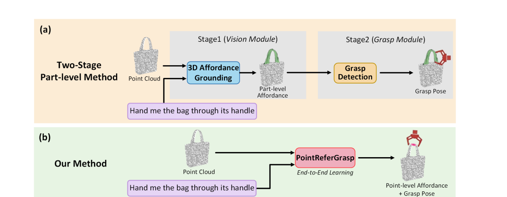
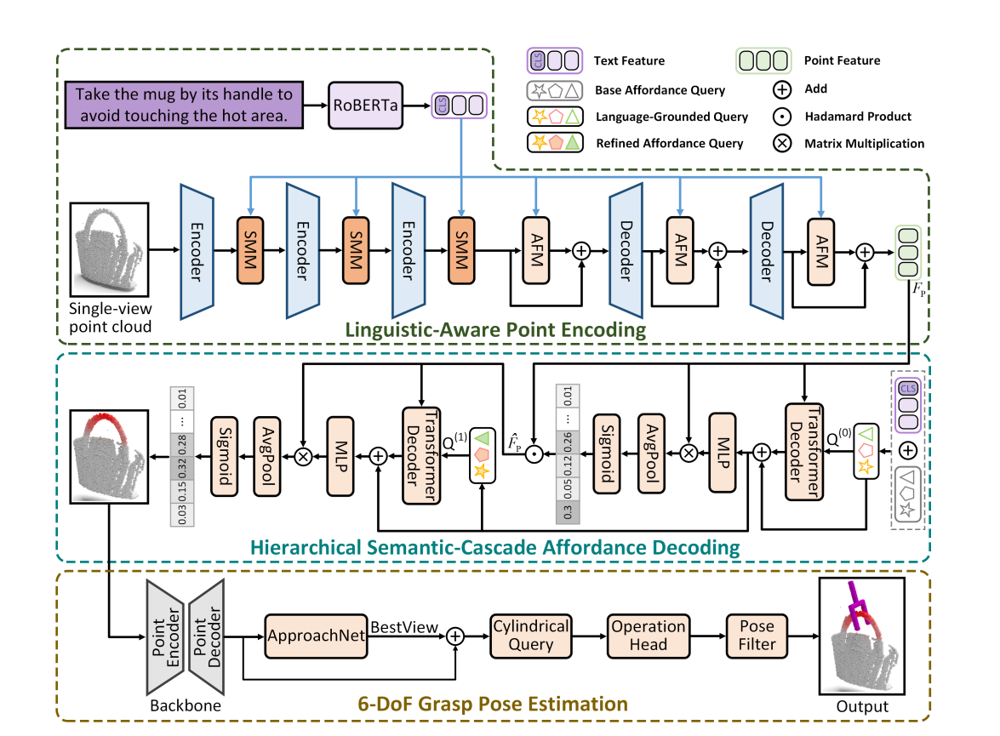
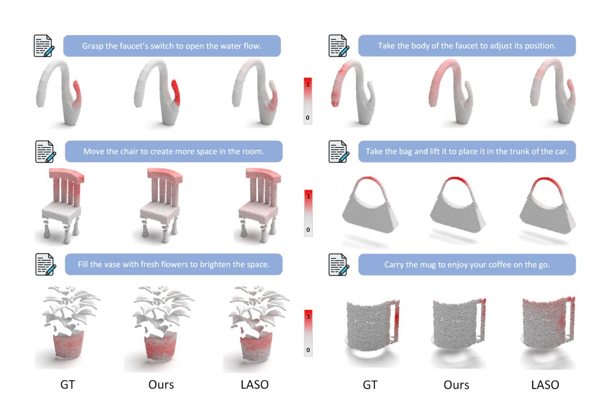
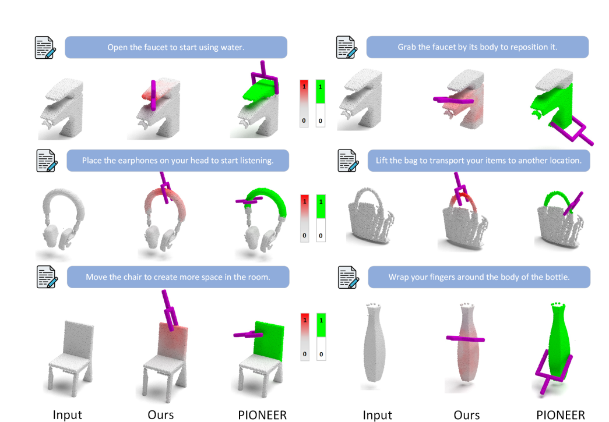

<div align="center">

# PointReferGrasp

### End-to-End Learning of Affordance-Grounded Grasp Detection from Single-View Point Clouds

**Yuming Gao · Lichun Wang · Jiaqi Zheng · Kai Xu · Huayang Yao · Baocai Yin**

[](https://www.python.org/)
[](https://pytorch.org/)


[News](#news) · [Overview](#overview) · [Method](#method) · [Dataset](#3d-affordancegrasp-dataset) · [Installation](#installation) · [Quick Start](#quick-start) · [Results](#results) · [Citation](#citation)

</div>

> [!WARNING]
> ### The dataset is not publicly available yet
> The **3D AffordanceGrasp dataset has not been released**. This repository currently contains a partial code release and does **not** include dataset files, pretrained checkpoints, or the complete 6-DoF grasp pipeline. Download links, annotations, licenses, and reproducible evaluation scripts will be added after the release is finalized.

## News

- **2026-08:** PointReferGrasp project repository and initial affordance-grounding code released.
- **Coming soon:** 3D AffordanceGrasp dataset, pretrained checkpoints, complete 6-DoF grasp code, and robot-demo instructions.

## Overview

PointReferGrasp takes a **single-view point cloud** and a **natural-language instruction** as input, then jointly predicts a fine-grained point-wise affordance map and executable 6-DoF grasp poses.

Unlike conventional two-stage methods that treat an entire object part as uniformly graspable, PointReferGrasp learns where a grasp is both semantically appropriate and physically executable. This helps avoid unstable poses near part edges and connections.

<p align="center">
  
</p>
<p align="center"><em>PointReferGrasp replaces a decoupled part-level pipeline with end-to-end point-wise affordance grounding and grasp estimation.</em></p>

### Highlights

| Component | Description |
| --- | --- |
| **End-to-end prediction** | Joint point-wise affordance grounding and 6-DoF grasp estimation. |
| **SMM** | Injects global language semantics into point-cloud features through feature-wise modulation. |
| **HSCAD** | Progressively refines affordance grounding from coarse object regions to fine functional details. |
| **HCFCL** | Uses hierarchical contrastive learning and hard-negative mining to sharpen functional boundaries. |
| **3D AffordanceGrasp** | A benchmark with language instructions, point-wise soft affordance labels, and 6-DoF grasp annotations. |

## Method

PointReferGrasp contains four main components:

1. **Linguistic-Aware Point Encoding** extracts RoBERTa text features and PointNet++ geometric features, then performs language-conditioned semantic modulation.
2. **Hierarchical Semantic-Cascade Affordance Decoding (HSCAD)** first localizes a coarse functional region and then refines the point-wise affordance prediction.
3. **Hierarchical Coarse-to-Fine Contrastive Learning (HCFCL)** aligns linguistic and geometric features while suppressing hard negative regions.
4. **6-DoF Grasp Pose Estimation** predicts approach directions and grasp parameters from local geometry, then selects poses using the predicted affordance map.

<p align="center">
  
</p>
<p align="center"><em>Overall architecture of PointReferGrasp.</em></p>

## 3D AffordanceGrasp Dataset

> [!IMPORTANT]
> **Release status: NOT PUBLIC.** The dataset is still being organized and validated. There is currently no official download link.

Each sample is represented as $\mathcal{D}=(P,A,T,G)$, where $P$ is a single-view point cloud, $A$ is a point-wise soft affordance label, $T$ is a natural-language instruction, and $G$ contains point-wise 6-DoF grasp ground truths.

| Property | Value |
| --- | ---: |
| Instances | 8,837 |
| Object categories | 15 |
| Grasp-related affordances | 5 |
| Training instances | 7,070 |
| Test instances | 1,767 |

The five affordance types are `grasp`, `lift`, `move`, `open`, and `wrap grasp`. The release package will include checksums, licensing terms, annotation documentation, preprocessing tools, and official splits.

## Qualitative Results

### Point-wise affordance grounding

<p align="center">
  
</p>
<p align="center"><em>PointReferGrasp produces fine-grained affordance maps that more closely follow the ground-truth distribution than LASO.</em></p>

### Affordance-grounded 6-DoF grasp detection

<p align="center">
  
</p>
<p align="center"><em>Compared with the part-level PIONEER pipeline, PointReferGrasp selects grasp poses inside functionally appropriate regions.</em></p>

## Release Status

| Component | Status |
| --- | --- |
| Affordance-grounding model | ✅ Available |
| Training and grounding utilities | ✅ Available |
| 3D AffordanceGrasp dataset | ⏳ Coming soon |
| Pretrained checkpoints | ⏳ Coming soon |
| Complete 6-DoF grasp pipeline | ⏳ Coming soon |
| Reproducible evaluation and robot demos | ⏳ Coming soon |

## Installation

The original development environment used Python 3.8, PyTorch 1.10.1, torchvision 0.11.2, Transformers 4.30.2, and Open3D 0.16.0.

```bash
git clone https://github.com/huamo555/PointReferGrasp.git
cd PointReferGrasp

conda create -n pointrefergrasp python=3.8 -y
conda activate pointrefergrasp
```

> [!NOTE]
> `requirements.txt` is currently an environment snapshot and includes machine-local Conda build references. A clean reproducible environment file will be provided with the complete release. CUDA extensions such as `pointnet2-cuda` must match the installed PyTorch and CUDA versions.

## Data Preparation

The current grounding loader expects the following files:

```text
<data_root>/
├── anno_train.pkl
├── anno_val.pkl
├── anno_test.pkl
├── objects_train.pkl
├── objects_val.pkl
├── objects_test.pkl
└── Affordance-Question.csv
```

Before training, update `data_root` in `data_utils/shapenetpart.py`. These data files are **not included** because the dataset has not yet been publicly released.

## Quick Start

### Training

After the dataset becomes available and the environment is prepared:

```bash
python train_n.py \
  -v pointrefergrasp \
  -gpu 0 \
  --yaml config/default.yaml \
  --name PointReferGrasp
```

Training outputs are written to `runs/train/` by default.

### Evaluation and inference

Official checkpoints and reproducible evaluation commands will be published together with the complete code and dataset release.

## Results

### 3D AffordanceGrasp benchmark

| Split | Method | AP ↑ | AP@0.8 ↑ | AP@0.4 ↑ | DAP (cm) ↓ |
| --- | --- | ---: | ---: | ---: | ---: |
| Seen | PIONEER | 50.57 | 56.46 | 45.53 | 4.78 |
| Seen | **PointReferGrasp** | **65.06** | **69.96** | **60.43** | **1.72** |
| Unseen | PIONEER | 46.36 | 51.97 | 43.46 | 5.67 |
| Unseen | **PointReferGrasp** | **60.11** | **66.62** | **56.17** | **2.34** |

### Real-robot experiments

| Setting | PIONEER | PointReferGrasp |
| --- | ---: | ---: |
| Single-object success rate | 81.0% | **91.0%** |
| Multi-object success rate | 74.4% | **88.5%** |

## Repository Structure

```text
PointReferGrasp/
├── assets/                  # README figures
├── config/                  # Model and training configuration
├── data_utils/              # Dataset loading and preprocessing
├── model/                   # PointReferGrasp grounding modules
├── utils/                   # Losses, metrics, logging, and visualization
├── train_n.py               # Main grounding training entry point
├── inference.py             # Inference utility
└── requirements.txt         # Original environment snapshot
```

## Citation

If you find this project useful, please cite the manuscript:

```bibtex
@misc{gao2026pointrefergrasp,
  title  = {PointReferGrasp: End-to-End Learning of Affordance-Grounded Grasp Detection from Single-View Point Cloud},
  author = {Gao, Yuming and Wang, Lichun and Zheng, Jiaqi and Xu, Kai and Yao, Huayang and Yin, Baocai},
  year   = {2026},
  note   = {Manuscript}
}
```

## Acknowledgements

This project builds on PointNet++, RoBERTa, MinkowskiEngine, GraspNet-1Billion, 3D AffordanceNet, LASO, and related affordance-grounding and grasp-detection research. We thank their authors and contributors.

## Contact

For questions, suggestions, or collaboration, please open an issue in this repository.

## License

A project license will be added before the complete public release.
